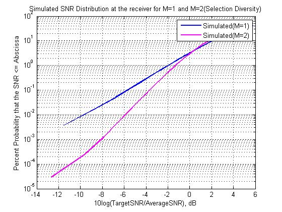

## Selection Diversity for Two Receive Antennas

### Introduction

Diversity schemes or techniques in wireless communication aim at improving the wireless link quality and reliability and attempts to make it as robust as possible. The wireless channel impairments due to multipath propagation, path loss, noise and interference in the channel becomes quite important to counter. Among many diversity schemes or techniques, the one that is employed in a wireless receiver is the receive diversity technique which effectively chooses the information received from all the receive antennas to demodulate and decode the information. Typically, receive diversity is implemented using approaches such as selection diversity, equal gain combining and maximum ratio combining. Professionally, I have worked on maximum ratio combining technique during design and development of wireless cellular systems. In this technical note, selection diversity is considered. Selection diversity applied to a wireless receiver selects the receive antenna with the highest received instantaneous power (measured in terms of signal-to-noise ratio) while ignoring signal from other receive antennas. In effect, it takes the maximum among all the received signal's signal-to-noise ratio at a given time.

### Simulation and Results

#### Channel Correlation Coefficient = 0.6

#### Channel Correlation Coefficient = 0.3

